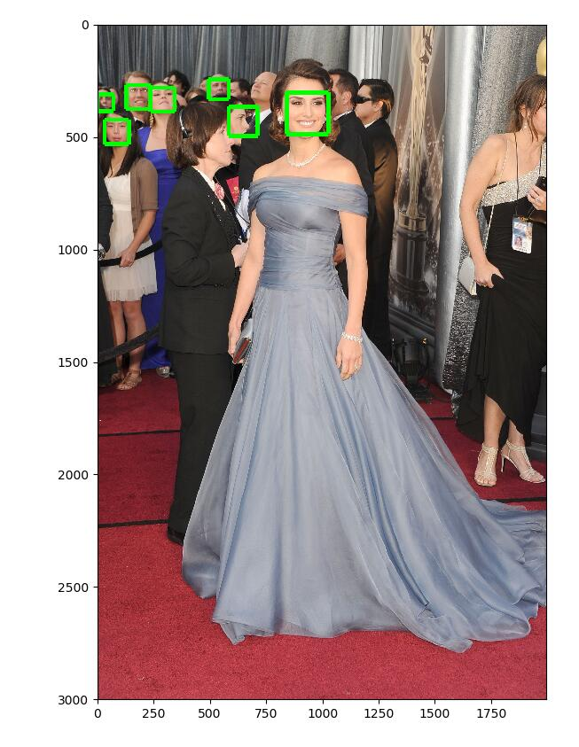
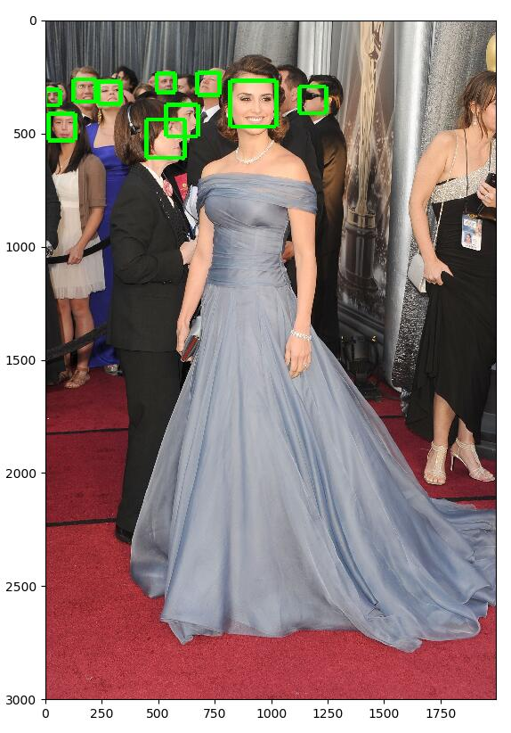
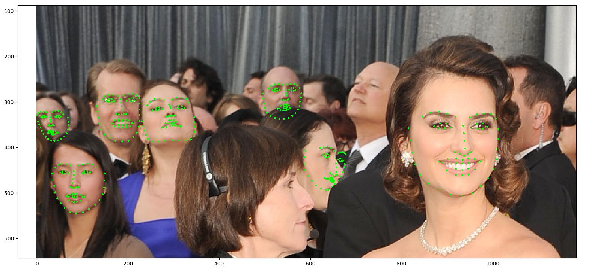

# facial-feature-extractor
APIs to extract facial feature from given image.

## Requirements

- face_recognition
- matplotlib
- numpy

## Experiments

### Face Locations

- Pure `face_recognition` implementation  

    - `model='hog'`  
        Fast, acceptable performance  

          

    - `model='cnn'`  
        **Extremely** slow, but significantly better on sideway face cases  

          

### Face Landmarks

- Pure `face_recognition` implementation  

    - `model=large` (72 points)  
        Medium in speed, tricky on sideway face cases  

          
